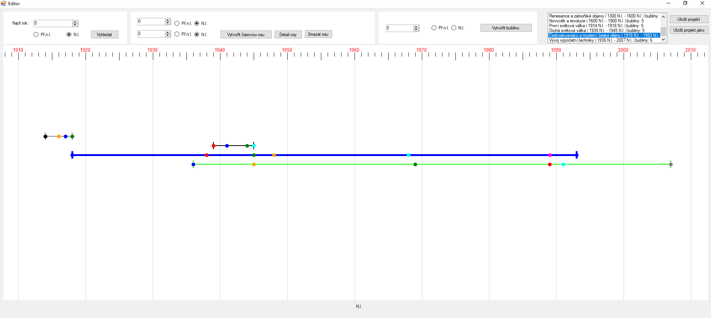

# 📅 Timelines

Desktopová aplikace pro práci s časovými osami (*timeline*), vytvořená v **C# pomocí WinForms**.

Aplikace umožňuje vytvářet vlastní historické nebo tematické časové osy, přidávat na ně události a upravovat jejich vlastnosti pomocí grafického editoru.

---

## 🧠 Popis projektu

Projekt slouží pro vizualizaci událostí na časové ose.

Uživatel může:

- vytvářet nové osy
- přidávat bubliny (události)
- upravovat názvy, datumy a popisy
- pracovat s časovou osou pomocí posunu a zoomu
- zobrazovat detail osy i detail konkrétní události
- pracovat s obdobími **N. l.** a **Př. n. l.**

---

## 🛠️ Použité technologie

- C#
- .NET WinForms
- Graphics / GDI+
- Visual Studio

---

## 🧩 Struktura projektu

### 📌 Hlavní části

### `Editor`

Hlavní okno aplikace.

Obsahuje:

- vykreslování timeline
- práci s myší
- zoom a posun osy
- správu linek a bublin

### `Meter`

Statická třída starající se o:

- vykreslení časové osy
- ticků
- roků
- výpočty pozic
- zoomování
- převod mezi rokem a pozicí na obrazovce

### `Line`

Reprezentuje jednu osu na timeline.

Obsahuje:

- časový interval
- směr osy
- seznam vlastních bublin
- vykreslování osy
- detekci zaměření myši

### `Bubble`

Reprezentuje jednu událost na timeline.

Obsahuje:

- rok
- měsíc
- den
- název
- popis
- barvu
- vlastní pozici na ose

### `DetailBubble`

Formulář pro detail a editaci bubliny.

Umožňuje:

- upravit název události
- upravit datum
- změnit popis
- změnit barvu
- přidávat další bubliny na stejnou osu
- mazat bubliny
- přepínat mezi bublinami

### `DetailLine`

Formulář pro detail osy.

Umožňuje:

- upravit název osy
- zobrazit rozsah osy
- zobrazit počet bublin
- zobrazit příbuzné / překrývající se osy
- mazat osy

### `Direction`

Pomocný enum určující směr:

- `Left` → Př. n. l.
- `Right` → N. l.

---

## 🎯 Funkcionalita

- vykreslení časové osy
- vytváření více os
- přidávání bublin k osám
- editace bublin
- editace detailu osy
- mazání bublin
- mazání os
- zoom časové osy
- posun časové osy
- práce s obdobím před naším letopočtem i našeho letopočtu

---

## 🖼️ Ukázka aplikace

!(images/detailOsy.png)
!(images/detailBubliny.png)
